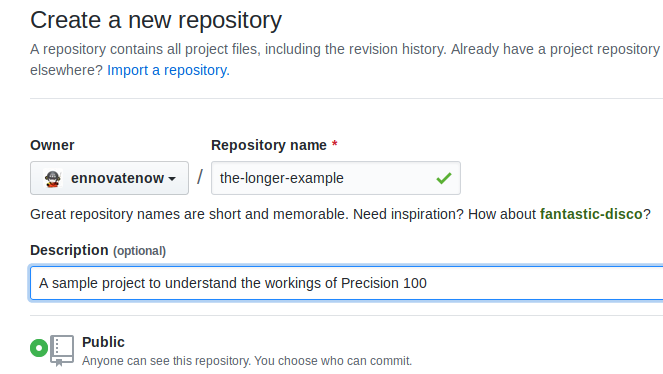
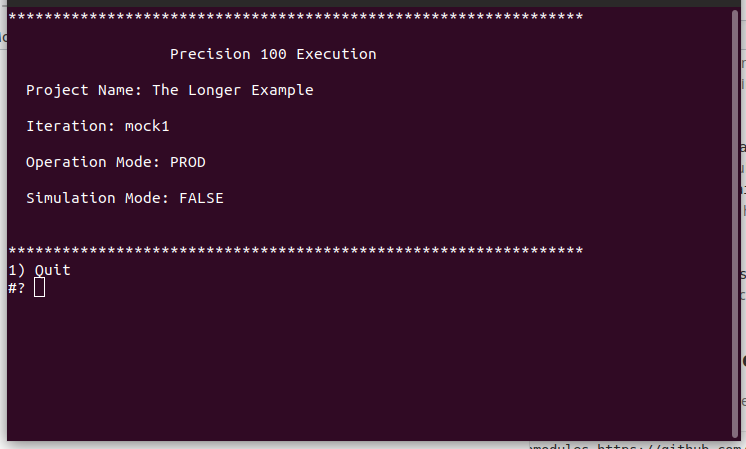

# Load and Spool Example
In this example, We will create a project to Create a table in a staging area, Load data into it  and then spool the data into a file. To achieve these tasks we will use the *sql-plus*, *loader* and the *spool* operator and learn about them. We will also learn a little about how **Precision 100** makes use of environment variables and also a little about `precision-native` client. 

We will use Github as a repository for this project.

## Prerequisities
To create and execute the project you need to have the following,

1. A [Github](https://www.github.com) account
2. Git client installed on your machine.
3. A running *Oracle* database with a schema named *precision100*
4. A working *sql plus* client
5. A working *sql loader* client

You can find many tutorials and videos to install Git on your operating system. e.g. you can look at [this one from Atlassian](https://www.atlassian.com/git/tutorials/install-git) or [this from the Git book](https://git-scm.com/book/en/v2/Getting-Started-Installing-Git)

Installing and confguring a Oracle database is beyond the scope of this tutorial. If you already have one, we can use it else the recommended way is to install [docker](https://docs.docker.com) for your operating system (You can find several tutorials to assist you with it. e.g. [here](https://docs.docker.com/)) and run a Oracle docker image. Articles like [these](https://sqlmaria.com/2017/04/27/oracle-database-12c-now-available-on-docker/) can help with it.

Next, you need to install *sqlplus* and *sqlldr*. These are Oracle client tools. You can learn more about them [here](https://www.oracle.com/technetwork/database/database-technologies/instant-client/overview/index.html). Specifically you need to install the the *base*, *sqlplus* and *tools* packages for your operating system.

You will also need to make *tns* entries to ensure that the *sqlplus* and *sqlldr* is able to connect to the Oracle database. After all the setup the following should connect to your database, if it is then we are ready to move to the next steps.

```
sqlplus precision100/yourprecisionpassword@sid
```

## Designing the Project
The goal of this example is to load data into a table and extract its contents onto a CSV file. Let us see the different ways we can do this.

We can have a single container where we can put the `instruction`s to create the table in the staging area, load it and then extract its contents into a file. We can then wrap the container in a `dataflow`. The `dataflow` is exposed to the `precision-native` client and on choosing this option it will execute all the `instruction`s at once. That is one way to do it, 3 `instruction`s, 1 `container` and 1 `dataflow`.

Lets look a another way to do the same thing, we can have three containers namely *setup*, *load* and *spool*. The *setup* `container` has the `instruction` to create the table in the staging area, the *load* `container` has the `instruction` to load the data into the table and finally the *spool* `container` has the `instruction` to generate the CSV file of the contents of the table. We can organize these `container`s in multiple ways. We have one `dataflow` to wrap all the three containers, in this case once the `dataflow` is exposed to `precision-native` we have one single menu option and all the `instruction`s are executed at once. Another way is to have 3 `dataflow`s, say named *setup*, *load* and *spool*. Each wrapping the eponymous `container`, when exposed in `precision-native` we would have 3 menu options.

There is no right or wrong way to organize your `instruction`s. It depends on how the project is going to be used. e.g. If this were a task which does not require any human intervention then having 1 `dataflow` with one `contianer` would suffice, and in all probablility we would be using `schedular-native` or some such `client`. On the other hand, like in this example we want to stop at every stage and check the results, it is good to distribute the `instruction`s across `container`s and `dataflow`s and execute them one by one.

In production the biggest factor in organizing your project is validating the result of each step. When you are loading data or performing complex validations it is a best practice to validate the results of each step before moving to the next. e.g. If you are loading a million records you want to make sure that the loading process actually loaded each of the records and if needed make corrections and rerun the load, before moving on the next steps. This would decide how the `dataflow`s and `container`s are organized.

For our example, we will design the project as follows,

| Dataflow | Container | Description |
|----------|-----------|-------------|
| Setup | setup | Drop and Create the table |
| Load | load | Truncate the table and load data into it |
| Spool | spool | Generate the CSV file |


## Creating the project
Create a new repository with the name "load-and-spool-example" with the description "A project to load data into a table and spool it into a file".



Now execute the following commands.
```
git clone https://github.com/ennovatenow/load-and-spool-example.git load-and-spool-example

cd load-and-spool-example
mkdir dataflows
touch dataflows/project.reg
mkdir -p containers/setup
touch containers/setup/container.reg
mkdir -p containers/load
touch containers/load/container.reg
mkdir -p containers/spool
touch containers/spool/container.reg

git add .
git commit -m "created the template"
git push origin master
```

### Adding `dataflow`s
The part upto this should be familiar, we have created an empty project with the appropriate `container`s. If we run this project using the `precision-native` client we will see a menu with just *Quit* as the option. Now lets update the project to expose the menu options we want. Execute the following,

```
echo "Setup the staging area,setup" > dataflows/project.reg
echo "Load data into staging,load" >> dataflows/project.reg
echo "Spool the file,spool" >> dataflows/project.reg

echo "setup" > dataflows/setup.reg
echo "load" > dataflows/load.reg
echo "spool" > dataflows/spool.reg

git add .
git commit -m "Added dataflow registry files to the project"
git push origin master
```

Lets run the project again this time the menu should be as seen in the image below.
```
git clone --recurse-submodules https://github.com/ennovatenow/precision-native.git tle-client
cd tle-client
./configure-project.sh "GIT" "https://github.com/ennovatenow/the-longer-example.git" "The Longer Example"
/init-exec.sh "mock1"
./migrate.sh
```



## Adding `instruction`s
Even though we have a menu now, It still does not do anything. Choosing any of the options just produces logs but there is nothing happening. It is time we added some `instruction`s to achieve what we want.

The first thing we want is to create a table in the staging area i.e in the *precision100* Oracle schema. To execute a *sql* in a Oracle database we need to use the *sql* opreator. Let us add an `instruction` to run a file named *setup.sql*. Execute the following,

```
touch containers/setup/setup.sql
echo "10,setup.sql,sql" > containers/setup/container.reg

git add .
git commit -m "Added instruction to execute a SQL file"
git push origin master
```

The `instruction` we are giving here is use the *sql* operator to run the *setup.sql* file which is located in the `container`. The number *10* is an index that decides the order of the `instruction`s. Since there is only one `instruction` the sequence attribute does not matter in this case. 

### Installing the *sql-plus* `operator`
Before we proceed any further we need to install the *sql-plus* `operator`. By default the **Precision 100** framework comes only with the *shell* operator, other `operator`s need to be installed. To install the `operator` execute the following,

```
git clone https://github.com/ennovatenow/precision-100-operators.git OPERATORS

./bin/install-operators.sh ./OPERATORS/operators sql-plus
```

### Installing the *oracle* `connect-operator` 
The *sql-plus* `operator` can be used to execute *sql* files, however it still needs credentials to connect to the Oracle database. `connect-operator`s extract the credentials from the credential store i.e *.connections.env.sh*. To install the *oracle* *connect-operator* execute the following,

```
./bin/install-connect-operators.sh ./OPERATORS/connect-operators/ oracle
```

### Configuring the connection
To connect to the database the credentials must be stored to the credential store. Execute the following,

```
echo "PRECISION100_CONNECTION,ORACLE,precision100,Welcome123,mig" > ./conf/.connections.env.sh
```

The credentials take the form "Connection Name,Operator Name, Schema Name, Password, Sid"

