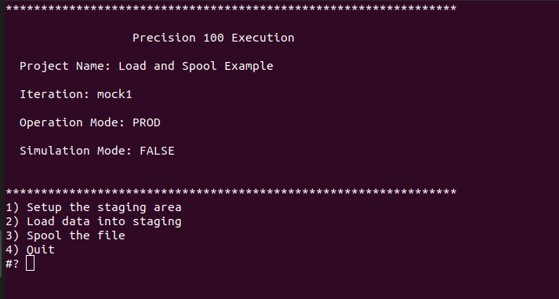

# Load and Spool Example
In this example, We will create a project to Create a table in a staging area, Load data into it  and then spool the data into a file. To achieve these tasks we will use the *sql-plus*, *loader* and the *spool* operator and learn about them. We will also learn a little about how **Precision 100** makes use of environment variables and also a little about `precision-native` client. 

We will use Github as a repository for this project.

## Prerequisities
To create and execute the project you need to have the following,

1. A [Github](https://www.github.com) account
2. Git client installed on your machine.
3. A running *Oracle* database with a schema named *precision100*
4. A working *sql plus* client
5. A working *sql loader* client

You can find many tutorials and videos to install Git on your operating system. e.g. you can look at [this one from Atlassian](https://www.atlassian.com/git/tutorials/install-git) or [this from the Git book](https://git-scm.com/book/en/v2/Getting-Started-Installing-Git)

Installing and confguring a Oracle database is beyond the scope of this tutorial. If you already have one, we can use it else the recommended way is to install [docker](https://docs.docker.com) for your operating system (You can find several tutorials to assist you with it. e.g. [here](https://docs.docker.com/)) and run a Oracle docker image. Articles like [these](https://sqlmaria.com/2017/04/27/oracle-database-12c-now-available-on-docker/) can help with it.

Next, you need to install *sqlplus* and *sqlldr*. These are Oracle client tools. You can learn more about them [here](https://www.oracle.com/technetwork/database/database-technologies/instant-client/overview/index.html). Specifically you need to install the the *base*, *sqlplus* and *tools* packages for your operating system.

You will also need to make *tns* entries to ensure that the *sqlplus* and *sqlldr* is able to connect to the Oracle database. After all the setup the following should connect to your database, if it is then we are ready to move to the next steps.

```
sqlplus precision100/yourprecisionpassword@sid
```

## Designing the Project
The goal of this example is to load data into a table and extract its contents onto a CSV file. Let us see the different ways we can do this.

We can have a single container where we can put the `instruction`s to create the table in the staging area, load it and then extract its contents into a file. We can then wrap the container in a `dataflow`. The `dataflow` is exposed to the `precision-native` client and on choosing this option it will execute all the `instruction`s at once. That is one way to do it, 3 `instruction`s, 1 `container` and 1 `dataflow`.

Lets look a another way to do the same thing, we can have three containers namely *setup*, *load* and *spool*. The *setup* `container` has the `instruction` to create the table in the staging area, the *load* `container` has the `instruction` to load the data into the table and finally the *spool* `container` has the `instruction` to generate the CSV file of the contents of the table. We can organize these `container`s in multiple ways. We have one `dataflow` to wrap all the three containers, in this case once the `dataflow` is exposed to `precision-native` we have one single menu option and all the `instruction`s are executed at once. Another way is to have 3 `dataflow`s, say named *setup*, *load* and *spool*. Each wrapping the eponymous `container`, when exposed in `precision-native` we would have 3 menu options.

There is no right or wrong way to organize your `instruction`s. It depends on how the project is going to be used. e.g. If this were a task which does not require any human intervention then having 1 `dataflow` with one `contianer` would suffice, and in all probablility we would be using `schedular-native` or some such `client`. On the other hand, like in this example we want to stop at every stage and check the results, it is good to distribute the `instruction`s across `container`s and `dataflow`s and execute them one by one.

In production the biggest factor in organizing your project is validating the result of each step. When you are loading data or performing complex validations it is a best practice to validate the results of each step before moving to the next. e.g. If you are loading a million records you want to make sure that the loading process actually loaded each of the records and if needed make corrections and rerun the load, before moving on the next steps. This would decide how the `dataflow`s and `container`s are organized.

For our example, we will design the project as follows,

| Dataflow | Container | Description |
|----------|-----------|-------------|
| Setup | setup | Drop and Create the table |
| Load | load | Truncate the table and load data into it |
| Spool | spool | Generate the CSV file |


## Creating the project
Create a new repository with the name "load-and-spool-example" with the description "A project to load data into a table and spool it into a file".


Now execute the following commands.
```
git clone https://github.com/ennovatenow/load-and-spool-example.git load-and-spool-example

cd load-and-spool-example
mkdir dataflows
touch dataflows/project.reg
mkdir -p containers/setup
touch containers/setup/container.reg
mkdir -p containers/load
touch containers/load/container.reg
mkdir -p containers/spool
touch containers/spool/container.reg

git add .
git commit -m "created the template"
git push origin master
```

### Installing and Configuring the `precision-native` client
The part upto this should be familiar, we have created an empty project with the appropriate `container`s. Lets configure the project in preparation of the the first iteration the project using the `precision-native` client. 

```
git clone --recurse-submodules https://github.com/ennovatenow/precision-native.git lase-client
cd lase-client
./configure-project.sh "GIT" "https://github.com/ennovatenow/load-and-spool-example.git" "Load and Spool Example"
```

With this we have installed the `precision-native` client and configured it to execute the "Load and Spool Example".


### Adding `dataflow`s
Now that we have the `precision-native` client installed and configured, lets add `dataflows`s and get a functional menu. Execute the following in the *load-and-spool-example* folder,

```
cd load-and-spool-example
echo "Setup the staging area,setup" > dataflows/project.reg
echo "Load data into staging,load" >> dataflows/project.reg
echo "Spool the file,spool" >> dataflows/project.reg

echo "setup" > dataflows/setup.reg
echo "load" > dataflows/load.reg
echo "spool" > dataflows/spool.reg

git add .
git commit -m "Added dataflow registry files to the project"
git push origin master
```

### Running the project
Lets run the project, we should see the menu as follows,

```
cd lase-client
git clone --recurse-submodules https://github.com/ennovatenow/precision-native.git lase-client
cd lase-client
./init-exec.sh "mock1"
./migrate.sh
```



With this we have a working project with a functional menu. We will close the iteration and proceed to the next step
```
./close-exec.sh "mock1"
```

## Adding the *sql* `instruction`
Even though we have a menu now, It still does not do anything. Choosing any of the options just produces logs but there is nothing happening. It is time we added some `instruction`s to achieve what we want.

The first thing we want is to create a table in the staging area i.e in the *precision100* Oracle schema. To execute a *sql* in a Oracle database we need to use the *sql* opreator. Let us add an `instruction` to run a file named *setup.sql*. Execute the following,

```
cd load-and-spool-example
touch containers/setup/setup.sql
echo "10,setup.sql,sql" > containers/setup/container.reg

git add .
git commit -m "Added instruction to execute a SQL file"
git push origin master
```

The `instruction` we are giving here is use the *sql* operator to run the *setup.sql* file which is located in the `container`. The number *10* is an index that decides the order of the `instruction`s. Since there is only one `instruction` the sequence attribute does not matter in this case. 

### Installing the *sql-plus* `operator`
Before we proceed any further we need to install the *sql-plus* `operator`. By default the **Precision 100** framework comes only with the *shell* operator, other `operator`s need to be installed. To install the `operator` execute the following,

```
cd lase-client
git clone https://github.com/ennovatenow/precision-100-operators.git OPERATORS
./bin/install-operators.sh ./OPERATORS/operators sql-plus
```

### Installing the *oracle* `connect-operator` 
The *sql-plus* `operator` can be used to execute *sql* files, however it still needs credentials to connect to the Oracle database. `connect-operator`s extract the credentials from the credential store i.e *.connections.env.sh*. To install the *oracle* *connect-operator* execute the following,

```
cd lase-client
./bin/install-connect-operators.sh ./OPERATORS/connect-operators/ oracle
```

### Configuring the connection
To connect to the database the credentials must be stored to the credential store. Execute the following,

```
cd lase-client
echo "PRECISION100_CONNECTION,ORACLE,precision100,Welcome123,mig" > ./conf/.connections.env.sh
```

The credentials take the form "Connection Name,Operator Name, Schema Name, Password, Sid". Change the values accordingly.

### Running the `dataflow`
With the connection configured we have everything we need to execute the *setup* `dataflow`. So lets update *setup.sql* with the sql to create the table, run the *setup* menu option and check the database for the created table.

```
cd load-and-spool-example
echo "DROP TABLE NAME_LIST;" > containers/setup/setup.sql
echo "CREATE TABLE NAME_LIST ( id number, state nvarchar2(2), gender nvarchar2(1), year nvarchar2(4), name nvarchar2(255), usage number); " >> containers/setup/setup.sql

git add .
git commit -m "Added proper create table sql to setup.sql"
git push origin master
```

Now we have a proper sql ready to be executed.

```
cd lase-client
./init-exec.sh "mock2"
./migrate.sh 
```

Now we should have menu options as shown below,


Choose menu option 1, it should execute the `dataflow` and we should have a log as below,


Connect to the database using *sql plus* and the table "NAME_LIST" should have been created in the database.


And there we have it, the first `instruction` executed by the framework. Lets close *mock2* iteration and move ahead to complete the rest of the `instruction`s we need to complete the example.

```
./close-exec.sh "mock2"
```

### Summary
Before we go ahead, lets summarize what we have seen so far.
1. Specific `instruction`s require `operator`s. e.g Executing sql statements require a *sql* `operator`, executing shell scripts require the *shell* `operator` etc.
2. `operator`s other than the *shell* `operator` need to be installed.
3. Each `operator` expects parameters like files in specific locations. e.g. *sql* `operator` expects the *sql* file in the `container`.
4. Some `operator`s need connections, these are enabled by using `connect-operators`. e.g. *Oracle* `connect-operator` to connect to the Oracle Database
5. Credentials for connections are stored in *conf/.connections.env.sh* - the connection entry in this file depends on the `connect-operator`.

### Loading the data
To load the data into the table we need to use the *loader* `operator`. 

The *loader* operator requires the following,
1. A *ctl* file should be present in the same `container` as the `instruction` and 
2. The data file to be loaded should be present in the *PRECISION100_OPERATOR_LOADER_INPUT_FOLDER* folder 
3. The name of the data file should match the *ctl* file. e.g *name_list.ctl* file will load *name_list.dat*
4. Oracle `connect-operator` is required
5. Oracle connection credentials are required

Of the above, *4* and *5* are in place. Lets install the *loader* `operator`.

```
cd lase-client
./bin/install-operators.sh ./OPERATORS/operators loader;
```

Now lets add the *ctl* and *dat* files to the project. You can find the *ctl* file [here](https://github.com/ennovatenow/load-and-spool-example/blob/master/name_list.ctl) and the *dat* file [here](https://github.com/ennovatenow/load-and-spool-example/blob/master/name_list.dat). Copy the files to the *containers/load* folder. As mentioned above, for the *loader* `operator` to work, the *ctl* file needs to be in the `container` and the *dat* file must be present in the *PRECISION100_OPERATOR_LOADER_INPUT_FOLDER* folder. We have put both the files in the `container` and we need to move the *dat* file to the *PRECISION100_OPERATOR_LOADER_INPUT_FOLDER* folder. This file move can be achieved by a *shell* `instruction`. 

Execute the following,
```
cd load-and-spool-example
cp name_list.ctl containers/load/name_list.ctl
cp name_list.dat containers/load/name_list.dat

echo "CONTAINER=\$1" > containers/load/copy_file.sh
echo "cp \$PRECISION100_EXECUTION_CONTAINER_FOLDER/\$CONTAINER/name_list.dat \$PRECISION100_OPERATOR_LOADER_INPUT_FOLDER/name_list.dat" >> containers/load/copy_file.sh
chmod u+x containers/load/copy_file.sh

echo "10,copy_file.sh,sh" > containers/load/container.reg
echo "20,name_list.ctl,loader" >> containers/load/container.reg

git add .
git commit -m "Added instructions and files to load data"
git push origin master
```

The first two command are self explanatory. Copy the *ctl* and *dat* files to the *load* `container`. (remember to change to copy the files from where ever you have downloaded them). Next we create a *shell* script. This is a simple script, it merely copies the *dat* file to the appropriate folder so that the next `instruction` i.e. *loader* can load the data. Finally we add the `instruction`s to the registry file.

The interesting part of the shell script is how it finds the location where the *dat* file needs to be copied to. What are *PRECISION100_EXECUTION_CONTAINER_FOLDER* and *PRECISION100_OPERATOR_LOADER_INPUT_FOLDER* ? For that we need to goto the next section.

### **Precision 100** Environment variables
**Precision 100** framework defines a lot of environment variables, these variables drive the execution of the framework. All variables defined by **Precision 100** or by its `clients` take the format *PRECISION100_<CONTEXT>_<VARIABLE>*.  The *CONTEXT* defines the life time of the variables e.g. if the context is *EXECUTION*, then these variables are set when you run *init-exec.sh* for the *iteration*

PRECISION100_EXECUTION_CONTAINER_FOLDER - points to the *containers* folder in the project for the current `iteration`.
PRECISION100_OPERATOR_LOADER_INPUT_FOLDER - points to the *loader* input folder in the project for the current `iteration`.

These values are all set before the `instrution`s are executed and hence are available to them always. To get a complete list of environment variables look [here](./environment-variable-list.md) and [here](./operators.md)


### Running the project
With the *load* `instruction`s all completed lets run the project. Execute the following,

```
cd lase-client
./init-exec.sh "mock3"
./migrate.sh 
```
Choose options *1* and *2*, we should see a log as below for option *2*.


Connect to the database using *sql plus* and "NAME_LIST" table should have been created in the database and have records in them.


And we have loaded data into a database table successfully. In a production scenario we will never checkin the data file into the repository. In all probability we will extract the data file from source system or we will be provided the same - in either case we need to make sure that the file follows proper naming convention and is moved to the correct folder for the *loader* operator to pick it up. We can use the *shell* operator to do both these activities.

The *loader* is not the only way to load data into the database. If the data were static we could have created *sql* statements in a file and used the *sql* operator to execute the file and load the data into the table. We can also use the *smart-loader* `operator` which just needs the table name as a parameter and it generates the *ctl* file dynamically!

Lets close this `iteration` and go ahead and complete the last step of our example, generating the CSV file output of the contents of our table.

```
./close-exec.sh "mock3"
```

### Spooling the data
To generate the CSV file output (spooling in Oracle parlance) we need to use the *spool* `operator`.

The *spool* `operator` requires the following,

1. The name of the table whose contents we need to export to a file.
2. The name of the file generated will be *table name*.csv and will be located in the *PRECISION100_OPERATOR_SPOOL_FOLDER*
3. Oracle connect-operator is required
4. Oracle connection credentials are required

Lets install the *spool* `operator`.

```
cd lase-client
./bin/install-operators.sh ./OPERATORS/operators spool;
```
Now lets go ahead and add the `instruction` to generate the CSV output

```
cd load-and-spool-example
echo "10,NAME_LIST,spool" > containers/spool/container.reg

git add .
git commit -m "Added instruction to generate the CSV file"
git push origin master
```

That is it, lets now run the project.

### Running the project
Execute the following to run the project,

```
cd lase-client
./init-exec.sh "mock4"
./migrate.sh 
```

Choose options *1*, *2* and *3*. you should get a log as below for option *3*


