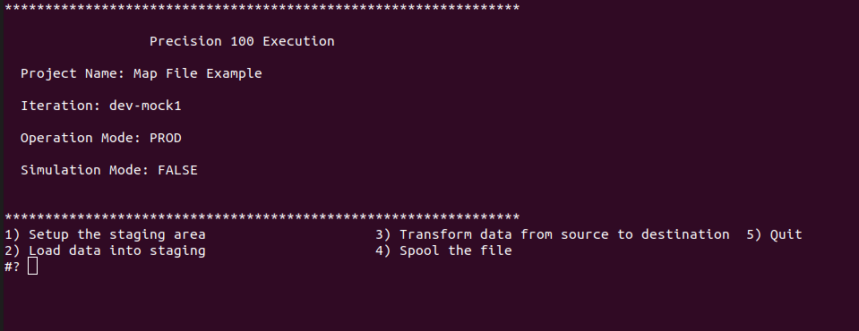

# Using the *map-file* `operator`
This example will extend the [load and spool example](./load-and-spool.md) and illustrate the use of the *map-file* `operator`. The *map-file* `operator` transforms data from source to destination. It uses a *map-file* to describe the mapping between the source and the destination. 

Lets define the problem. The target system expects the following,
1. Data should provided in a CSV format file
2. The CSV file should have the following attributes - Name, Gender, DOB, State, Address 1, Address 2, Old Reference Number, Load Date, Record Flag
3. Name should be in upper case and have a maximum length of 50 characters. Mandatory
4. Gender should be 1 for Male and 2 for Female. Maximum length of 1 character. Mandatory
5. DOB should be in 'yyyy-mm-dd' format. Maximum length 10 characters. Mandatory
6. State should be full name in upper case i.e OHIO for OH. Maximum length 50 characters. Mandatory
7. Address 1. Maximum length 50 characters. Optional
8. Address 2. Maximum length 50 characters. Optional
9. Old Reference Number should be the reference number of the old records. Maximum length 50 characters. Optional
10. Load Date. Should be in 'yyyy-mm-dd' format. Maximum length 10 characters. Mandatory
11. Record Flag. Should be 'NEW' for all records. Maximum length 50 characters. Mandatory

## Prerequisities
To create and execute the project you need to have the following,

1. A [Github](https://www.github.com) account
2. Git client installed on your machine.
3. A running *Oracle* database with a schema named *precision100*
4. A working *sql plus* client
5. A working *sql loader* client

You can find many tutorials and videos to install Git on your operating system. e.g. you can look at [this one from Atlassian](https://www.atlassian.com/git/tutorials/install-git) or [this from the Git book](https://git-scm.com/book/en/v2/Getting-Started-Installing-Git)

Installing and confguring a Oracle database is beyond the scope of this tutorial. If you already have one, we can use it else the recommended way is to install [docker](https://docs.docker.com) for your operating system (You can find several tutorials to assist you with it. e.g. [here](https://docs.docker.com/)) and run a Oracle docker image. Articles like [these](https://sqlmaria.com/2017/04/27/oracle-database-12c-now-available-on-docker/) can help with it.

Next, you need to install *sqlplus* and *sqlldr*. These are Oracle client tools. You can learn more about them [here](https://www.oracle.com/technetwork/database/database-technologies/instant-client/overview/index.html). Specifically you need to install the the *base*, *sqlplus* and *tools* packages for your operating system.

You will also need to make *tns* entries to ensure that the *sqlplus* and *sqlldr* is able to connect to the Oracle database. After all the setup the following should connect to your database, if it is then we are ready to move to the next steps.

```
sqlplus precision100/yourprecisionpassword@sid
```

## Designing the Project
The example requires that a we load data into a table, transform it to the requirements of the target system and generate a CSV file in the presecribed format. In that sense the project is very similar to the [load-and-spool-example](./load-and-spool.md) but with an extra step to transform the data. We will design the project as follows,


| Dataflow | Container | Description |
|----------|-----------|-------------|
| Setup | setup | Drop and Create the table |
| Load | load | Truncate the table and load data into it |
| Transform | transform | Transform the source to the target format |
| Spool | spool | Generate the CSV file |

## Creating the project
In most of our examples we created the entire project from scratch. However in production, we will never do that, we start by copying an existing project that most closely matches the current requirements and modify it. We will be doing the same here. We will create a new repository and then copy the contents of [load-and-spool-example](./load-and-spool.md). 

Create a new repository with the name "map-file-example" with the description "A project to load, transform data into a table using the map-file operator and spool it into a file".


Now execute the following to copy a repository,

```
git clone --bare https://github.com/ennovatenow/load-and-spool-example.git load-and-spool-example
cd load-and-spool-example
git push --mirror https://github.com/ennovatenow/map-file-example.git
```

And we have an identical copy of the project. Now lets go ahead make the modifications to match our design.

```
git clone https://github.com/ennovatenow/map-file-example.git map-file-example
mkdir -p containers/transform
touch containers/transform/container.reg

echo "transform" > dataflows/transform.reg
```

Use your favorite text editor to edit *dataflows/project.reg* and add this line just above *spool*, "Transform data from source to destination,transform", and commit your code.

```
cd map-file-example
git add .
git commit -m "Added transform dataflow"
git push origin master
```

With this we have a project which matches our design for this example. Now lets add the necessary operators and run the project.

## Running the Project
To execute this project we need to install the *precision-native* client and all the necessary operators and then configure the connection to the database.
 
```
git clone --recurse-submodules https://github.com/ennovatenow/precision-native.git mfe-client
cd mfe-client
./configure-project.sh "GIT" "https://github.com/ennovatenow/map-file-example.git" "Map File Example"
echo "PRECISION100_CONNECTION,ORACLE,precision100,Welcome123,mig" > ./conf/.connections.env.sh

git clone https://github.com/ennovatenow/precision-100-operators.git OPERATORS
./bin/install-operators.sh ./OPERATORS/operators sql-plus
./bin/install-connect-operators.sh ./OPERATORS/connect-operators/ oracle
./bin/install-operators.sh ./OPERATORS/operators loader
./bin/install-operators.sh ./OPERATORS/operators smart-loader
./bin/install-operators.sh ./OPERATORS/operators map-file

./init-exec.sh "dev-mock1"
./migrate.sh
```



The menu options behave exactly as in the  [load and spool example](load-and-spool.md). Choosing option *1* will create the tables in the database, option *2* will load the data into the table and option *4* will generate the CSV file. Now lets modify the project to transform the data using the *map-file* `operator` and then generate the CSV of the transformed data.

But before that, lets close the `iteration`

```
cd mfe-client
./close-exec.sh "dev-mock1"
```


## Using the *map-file* `operator`
We need the *map-file* `operator` to transform data in a table to another table. In order for *map-file* to work we need the following,

1. A *tsv* mapping file with a predefined structure must be present in the same `container` as the `instruction`.
2. Oracle `connect-operator` is required
3. Oracle database connection must be configured

The mapping file has the following columns,
1. Column Name, must be less than 30 characters
2. Data Type
3. Maximum Length
4. Mapping Type
5. Mapping Value

The *map-file* `operator` uses the mapping file for the following,
1. It creates a table with the name *O_filename* i.e. if the mapping file is named *casa.tsv*, the table will be called *O_CASA*.
2. The columns of the table match the *Column Name* column of the mapping file.
3. It uses the *Column Name*, *Mapping Type* and *Mapping Value* to consturct and execute a SQL statement that loads data into the table created above.

Lets create the mapping sheet for our problem,

| Column Name | Data Type | Maximum Length | Mapping Type | Mapping Value |
|-------------|-----------|----------------|--------------|---------------|
| name | VARCHAR | 50 | PASSTHRU | UPPER(NL.NAME) |
| gender | CHAR | 1 | PASSTHRU | CASE GENDER WHEN 'F' THEN '1' WHEN 'M' THEN 2 ELSE '2' END |
| dob | DATE | 10 | PASSTHRU | YEAR\|\|'-01-01' |
| state | VARCHAR | 50 | PASSTHRU | SM.STATE_NAME |
| address_1 | VARCHAR | 50 | | |
| address_2 | VARCHAR | 50 | | |
| old_ref_num | INTEGER | 50 | PASSTHRU | NL.ID |
| load_date | DATE | 10 | PASSTHRU | TO_CHAR(SYSDATE,'YYYY-MM-DD') |
| record_flag | VARCHAR | 10 | CONSTANT | NEW  |
| | | | \_\_JOIN\_\_ | FROM NAME_LIST NL |
| | | | \_\_JOIN\_\_ | INNER JOIN STATE_MAP SM ON NL.STATE = SM.STATE_CODE |

We are going to use the *map-file* `operator` to create a table whose columns have a one to one correspondance to the CSV file expected by the target system and then use the *spool* operator to generate the CSV file.

The first three columns of the mapping sheet are self explanatory. These attributes are defined by what the target system expects. The number of rows in the sheet maps to the columms of the table which the *map-file* `operator` is going to create. The interesting columns of the mapping sheet are the *MAPPING_TYPE* and the *MAPPING_VALUE*. There are several values for *MAPPING_TYPE*, but the ones are going to use are *PASSTHRU* and *CONSTANT*. As their names suggest, if any row has a *MAPPING_TYPE* as a *PASSTHRU* - the *MAPPING_VALUE* value is passed to the transformation sql as is, if the *MAPPING_TYPE* is *CONSTANT*, then the *MAPPING_VALUE* value will be passed to the transformation sql. Next we have a *MAPPING_TYPE* of *\_\_JOIN\_\_*, the *MAPPING_VALUE* value of such rows is added to the where condition of the transformation sql.

Lets look at how this mapping sheet is resolving our problem statement.

| Business Requirement | Mapping File Solution |
|----------------------|-----------------------|
| Name should be in upper case and have a maximum length of 50 characters | Use the Oracle function UPPER to conver the source data to upper case. Strictly speaking we should have used SUBSTR to cut the length of the source data to 50 characters. We didnt do this because profiling shows all our source data is less than 50 characters |
| Gender should be 1 for Male and 2 for Female. Maximum length of 1 character  | Use the SQL CASE statement to transform the source value of 'F' / 'M' to 2 and 1. We have also made the assumption that if there source has any invalid character, the we should default '2' |
| DOB should be in 'yyyy-mm-dd' format. Maximum length 10 characters | Since there is any Date of Birth in the source data we have chosen to default the value to 1st January for the year. |
| State should be full name in upper case i.e OHIO for OH. Maximum length 50 characters | We need to map the source values which are codes to names. To do this we use SQL to join the source table column with a mapping table that has the corresponding names for the states |
| Address 1. Maximum length 50 characters. | We dont have any data in the source to match this so we leave it blank |
| Address 2. Maximum length 50 characters. | We dont have any data in the source to match this so we leave it blank |
| Old Reference Number should be the reference number of the old records. Maximum length 50 characters | Point this attribute to the ID field of the source data.
| Load Date. Should be in 'yyyy-mm-dd' format. Maximum length 10 characters | Use the Oracle SYSDATE function to get the current date and then use the TO_CHAR function to convert it into the format we want |
| Record Flag. Should be 'NEW' for all records. Maximum length 50 characters | Map to a constant string 'NEW' |


Normally we would use a spreadsheet application to create this sheet and export the same as a tab-separated-value file. Lets add this file to the *containers/transform* container with the name *import_name.tsv* and the `instruction` for the *map-file* and run the project.

```
cd map-file-example
cp import_name.tsv containers/transform/

echo "10,import_name,map-file" > containers/transform/container.reg

git add .
git commit -m "added instructions for map-file transformation"
git push origin master
```

## Running the Project
Let run the project and take a look at the generated sql files.

```
cd mfe-client
./init-exec.sh "dev-mock2"
./migrate.sh
```

This should give us the same menu as before. Choose menu options *1*, *2* and *3*. For option *3* you should get a log as below,


If you look at the log it shows an error saying table does not exist, we will come to that. For now lets look at the SQL's generated by the map file. 

## *map-file* generated scripts
As mentioned above, the *map-file* `operator` generates SQL statements based on the mapping file and executes them. These files are created inn the *<iteration folder>/map-file/work* folders. Lets examine the files.

The create table script file names have the pattern *O-mapping-file.sql*. e.g. *O-import_name.sql*


The transformation script file names have the pattern *O-mapping-file-transform.sql*. e.g. *O-import_name-transform.sql*


It is easy to understand how the data in the mapping sheet is used to generate the scripts. It also explains why we get the error in the log file. The *NAME_LIST* table is created by executing the sql in the *setup* container. The data for the table is loaded by the *loader* `operator` in the *load* container. The table reflected in the log file has never been created or loaded anywhere. Also if we choose the menu option *4* we see that it generates *NAME_LIST.csv* which has data the source data. This is not we want, to complete our example we need to generate the CSV file for the transformed data. 

In the next step lets fix the error we got and also generate the CSV with the transformed data created by the *map-file* `operator`.

## Completing the example

