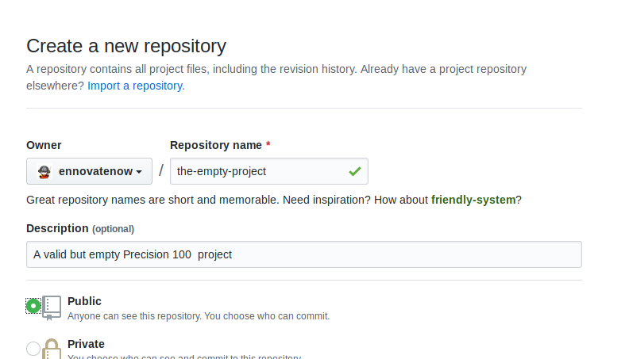

# The Empty Project
This example creates a empty but valid **Precision 100** project i.e. This project can be successfully interrogated by a **Precision 100** client without any errors. This example describes the project the layout and the minimal files required to make the project a valid **Precision 100** project.

## Prerequisities
To create and execute the project you need to have the following,

1. A [Github](https://www.github.com) account
2. Git client installed on your machine.

You can find many tutorials and videos to install Git on your operating system. e.g. you can look at [this one from Atlassian](https://www.atlassian.com/git/tutorials/install-git) or [this from the Git book](https://git-scm.com/book/en/v2/Getting-Started-Installing-Git)

## Creating the Project
Create a new repository in Github with the name “*the-empty-project*” with the description “A valid but empty Precision 100  project"



Now execute the following commands.
```
git clone https://github.com/ennovatenow/the-empty-project.git the-empty-project

cd the-empty-project
mkdir dataflows
touch dataflows/project.reg
mkdir -p containers/container-one
touch containers/container-one/container.reg
mkdir -p containers/container-two
touch containers/container-two/container.reg

git add .
git commit -m "created the template"
git push origin master
```
And we have perfectly valid and empty **Precision 100** project. (Change the git url to point to the repository you have created). 

The above instructions are straight forward, you create two folders at the root of the project i.e. `dataflows` and `containers`.Inside the `containers` folder we create two folders (containers in Precision 100 parlance), in this case we have named them, again very unimaginatively, `container-one` and `container-two`. 

Inside the `dataflows` and `container`s we put "`reg`" or registry files. These are special files and should be named exactly as mentioned. Each `container` should have a `container registry` file i.e `container.reg` and the `dataflows` folder must have a `project registry` file i.e `project.reg`. 

You can learn more about the project definintion in [concepts](./concepts.md)

## Running the-empty-project example
To run *the-empty-project* project, execute the following,
```
git clone --recurse-submodules https://github.com/ennovatenow/precision-native.git tep-client
cd tep-client
./configure-project.sh "GIT" "https://github.com/ennovatenow/the-empty-project.git" "The Empty Project"
/init-exec.sh "mock1"
./migrate.sh
```

If things have gone well you should see a menu and your screen should look like something below,

