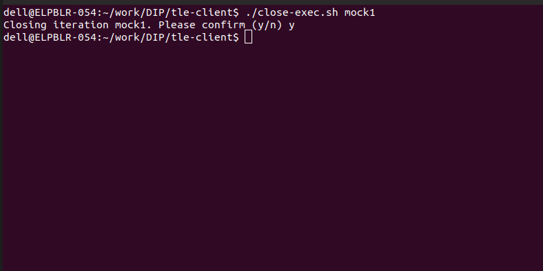
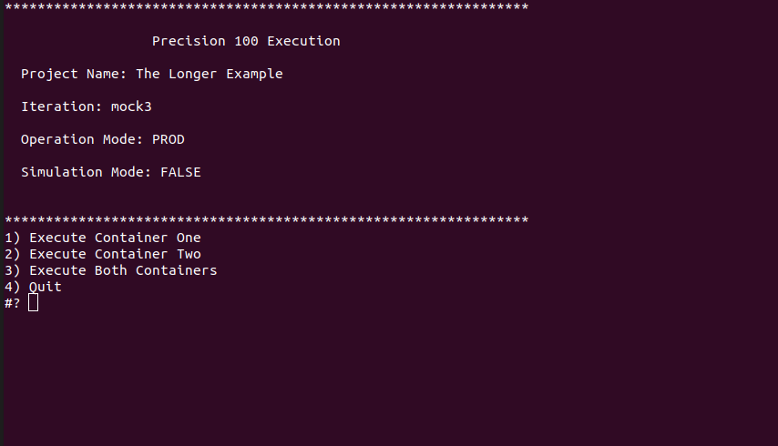
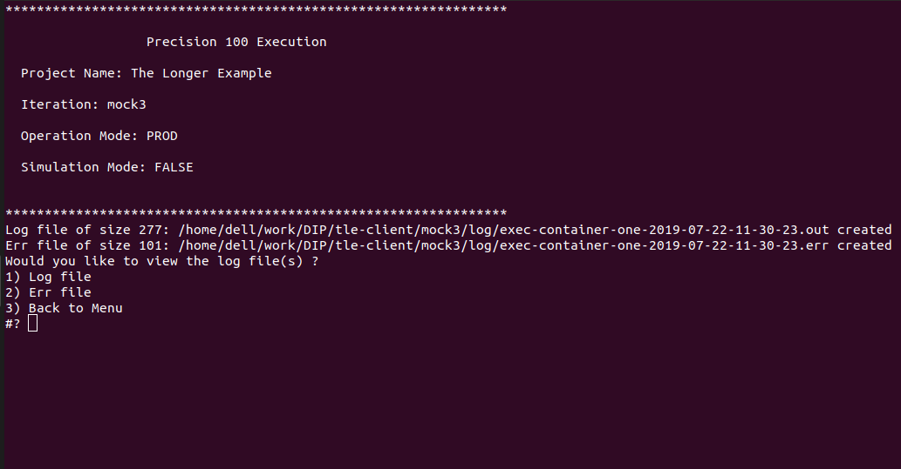
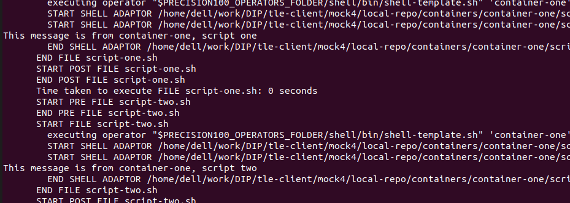
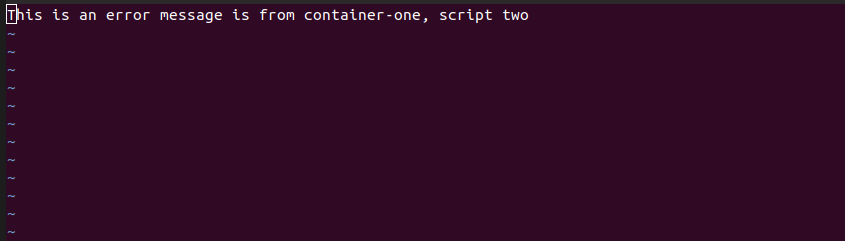

# The Longer Example
In this example we will start by creating a simple project that executes two shell scripts. We will not be using any design tool but rather build the entire project from scratch and execute it using **Precision100**. We will be using [Github](https://github.com) as a `repository` for this project. If you don't have an account there, you should get it before going any further. We will calling our project rather unimaginatively "the longer example", with that lets get started.

## Creating the Project.
Create a new repository with the name "the-longer-example" with the description "A sample project to understand the workings of Precision 100". 


Now execute the following commands.
```
git clone https://github.com/ennovatenow/the-longer-example.git the-longer-example

cd the-longer-example
mkdir dataflows
touch dataflows/project.reg
mkdir -p containers/container-one
touch containers/container-one/container.reg
mkdir -p containers/container-two
touch containers/container-two/container.reg

git add .
git commit -m "created the template"
git push origin master
```
And we have perfectly valid and of course a perfectly useless **Precision 100** project. (Change the git url to point to the repository you have created). 


The above instructions are straight forward, you create two folders at the root of the project i.e. `dataflows` and `containers`.Inside the `containers` folder we create two folders (containers in Precision 100 parlance), in this case we have named them, again very unimaginatively, `container-one` and `container-two`. 

Inside the `dataflows` and `container`s we put "`reg`" or registry files. These are special files and should be named exactly as mentioned. Each `container` should have a `container registry` file i.e `container.reg` and the `dataflows` folder must have a `project registry` file i.e `project.reg`. 

You can learn more about `registry` files and naming conventions in the best practices section of the documentation, but for now lets try to run this empty project.

## Running the-longer-example
To run the-longer-example project, execute the following,
```
git clone --recurse-submodules https://github.com/ennovatenow/precision-native.git tle-client
cd tle-client
./configure-project.sh "GIT" "https://github.com/ennovatenow/the-longer-example.git" "The Longer Example"
/init-exec.sh "mock1"
./migrate.sh
```

If things have gone well you should see a menu and your screen should look like something below,


That was quite a lot of work to get to a menu that just says Quit, it would seem that nothing has been done. Well, Yes and No. The fact that we were able to bring up the menu indicates that this is a valid project even though it is not doing anything (yet). Lets understand the activities performed here and then we will see how to make our project do something, and add those activities to the menu.

The first thing we do to run the project is to install one of the **Precision 100** clients. The **Precision 100** framework by itself does not provide any interface to run the project, this is done by **Precision100** clients. `precision-native` gives a menu-driven interface which can be used to run the project. 

Once the `precision-native` client is installed, we need to configure it to use our new project. This is done by invoking `configure-project.sh` script that is provided with the client. This script accepts the `repository` type, which can be GIT or SVN or FILE (default GIT), the URL of the `repository` and the name of the project. (Remember to give the URL of your newly created project here). With this, our installation is configured to our new project. **Precision 100** can have multiple installations but each installation can work with only one project.

Now that we have the project configured, its time to run the project. We can run our project multiple times. Each run is an `iteration`, so lets initialize the `iteration` and give the `iteration` a name. This is done by invoking `init-exec.sh` script provided with the client with the name of the `iteration` i.e. "mock1". This script connects to the URL configured for the project and retrieves it. Now if you do `ls` on the `tle-client` folder you will see that a new folder with the same name as the `iteration` has been created and inside it you will find `local-repo` folder which has the project that you had created.

Finally we run `migrate.sh`. This interogates the downloaded project and builds the menu based on the contents of the `project.reg` registry file in the `dataflows` folder. We have not added anything to this file and hence we get nothing in the menu except the default `Quit` option.

Before we do anythng else, we must first close the current `iteration`. This is necessary because we can only execute one `iteration` at a time. The `mock1` `iteration` must be closed. We can do this by invoking the `close-exec.sh` script provided by the client as shown below,



Now lets add menu options and run the project.

## Adding Options to the Menu
To add options to the `precision-native` menu, we need to go back and make changes to the files in our project and check them in. 

```
cd the-longer-example
echo "Execute Container One,exec-container-one" > dataflows/project.reg
echo "Execute Container Two,exec-container-two" >> dataflows/project.reg
echo "Execute Both Containers,exec-container-one-two" >> dataflows/project.reg

git add .
git commit -m "added entries to the project registry file"
git push origin master

```


Now, come back to the `tle-client` folder and lets try to run the project again. This time we dont need to clone or configure the project, we directly start a new iteration.

```
cd tle-client
/init-exec.sh "mock2"
./migrate.sh
```

Now you should see the menu as below,



And we have got ourselves a custom menu of our own!!

## Using `precision-native`
Before we go further, lets spend some time to examine the `precision-native` client. From the above example we can glean the following,
1. It allows you to configure the installation to a project.
2. It allows you to execute named `iteration`s.
3. For each `iteration` it checks out the latest code from the `repository`
4. It gives you a menu interface which it dynamically constructs from the project.

Now lets see what happens when you choose a menu option. If the menu is up, choose 1, if you had quit the menu, not problem just run `migrate.sh` again and then choose 1. You should see a screen as follows,



Once a menu option is chosen, two files created every time a menu option is chosen, a `log` file and an `err` file. These are the files we need to examine to see the output of the `instruction`s in the `container`s. If there are no errors reported during the execution we will have a 0 byte `err` file. The `log` file captures the progress of the execution.(Technically `log` and `err` files represent the `stdout` and `stderr` streams)

Now that we have learned about `precision-native` and we know where to go to find the outputs, lets go ahead and create some `instruction`s

## Adding `instruction`s
So far we have a valid **Precison 100** project with two empty `container`s, now lets add some `instructions` to the containers and invoke them from the `precision-native` menu.

```
cd the-longer-example
echo "echo \"This message is from container-one, script one\""  > containers/container-one/script-one.sh
echo "echo \"This message is from container-one, script two\""  > containers/container-one/script-two.sh
echo "echo \"This is an error message is from container-one, script two\" 1>&2"  >> containers/container-one/script-two.sh

echo "echo \"This message is from container-two, script one\""  > containers/container-two/script-one.sh

chmod u+x containers/container-one/script-one.sh
chmod u+x containers/container-one/script-two.sh
chmod u+x containers/container-two/script-one.sh

echo "container-one" > dataflows/exec-container-one.reg
echo "container-two" > dataflows/exec-container-two.reg
echo "container-one" > dataflows/exec-container-one-two.reg
echo "container-two" >> dataflows/exec-container-one-two.reg

echo "10,script-one.sh,sh" > containers/container-one/container.reg
echo "20,script-two.sh,sh" >> containers/container-one/container.reg
echo "10,script-one.sh,sh" > containers/container-two/container.reg

git add .
git commit -m "added instructions to the project"
git push origin master
```

That is a whole lot of echo's, but what we are doing here is very simple. We created three shell scripts, `script-one.sh`, `script-two.sh` in the `container-one` folder and `script-one.sh` in the `container-two` folder. We then created `exec-container-one` and `exec-container-two` `dataflow` registry files with appropriate entries and finally we then made entries to the `container.reg` registry files in the `container`s.

With this lets run the project again.(remember to close the previous `iteraton` using `close-exec.sh` or you wont be able to start new ones). 
```
cd tle-client
./init-exec.sh "mock4"
./migrate.sh
```

Lets choose Option 1 and look at the logs you should be able to see the messages coming from the scripts we added to the project.



The err file should have the error message we added in `script-two.sh`



So there we have it. A project that executes `instructions`, in this case the `instructions` are the shell scripts we added in the `containers`. The `instructions` could be sql scripts, loader scripts or any thing else. The order of execution of `container`s in defined in the `dataflow` registry files and the order of execution of `instructions` in a `container` registry file.

With these features we can execute an arbitrary number of commands (`instructions`). These commands can be organized into `dataflows` so that they can be executed all at once. Look at examples for the different kinds of `instructions` we can use and the different use cases where the **Precision 100** framework can be used.
