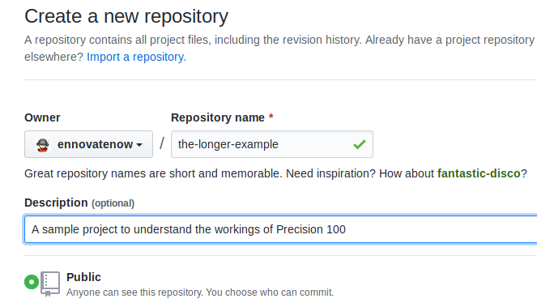

# The Longer Example
In this example we will start by creating a simple project that executes two shell scripts. We will not be using any design tool but rather build the entire project from scratch and execute it using **Precision100**. We will be using [Github](https://github.com) as a `repository` for this project. If you don't have an account there, you should get it before going any further. We will calling our project rather unimaginatively "the longer example", with that lets get started.

## Creating the Project.
Create a new repository with the name "the-longer-example" with the description "A sample project to understand the workings of Precision 100". 



Now execute the following commands.
```
git clone https://github.com/ennovatenow/the-longer-example.git the-longer-example

cd the-longer-example
mkdir dataflows
touch dataflows/project.reg
mkdir -p containers/container-one
touch containers/container-one/container.reg
mkdir -p containers/container-two
touch containers/container-two/container.reg

git add .
git commit -m "created the template"
git push origin master
```
And we have perfectly valid and of course a perfectly useless **Precision 100** project. (Change the git url to point to the repository you have created). 


The above instructions are straight forward, you create two folders at the root of the project i.e. `dataflows` and `containers`.Inside the `containers` folder we create two containers, in this case we have named them, again very unimaginatively, `container-one` and `container-two`. These names could be anything  and then we put "`reg`" or registry files in them. These are special files and should be named exactly as mentioned. Each `container` should have a `container registry` file i.e `container.reg` and the `dataflows` folder must have a `project registry` file i.e `project.reg`. 

You can learn more about `registry` files and naming conventions in the best practices section of the documentation, but for now lets try to run this empty project.

## Running the-longer-example
To run the-longer-example project, execute the following,
```
git clone --recurse-submodules https://github.com/ennovatenow/precision-native.git precision-native
cd precision-native
./configure-project.sh
```

